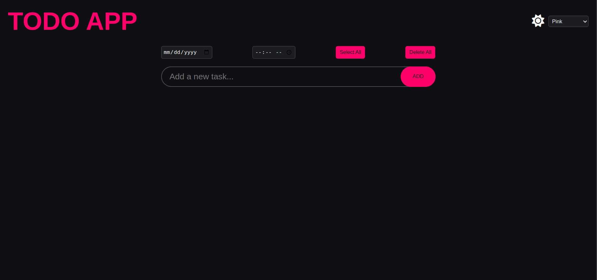

# ✅ To-Do List App

Welcome to the **To-Do List App**, a responsive and feature-rich task manager. This app is designed to work seamlessly across all devices and comes with both dark and light theme options, along with multiple color customizations. 🎨

## ✨ Features

- 📱 **Responsive Design:** The app adapts to different screen sizes, making it usable on mobile, tablet, and desktop devices.
- 🌗 **Dark & Light Mode:** Choose between dark and light themes based on your preference.
- 🎨 **Color Customization:** Multiple color themes available for further personalization.
- 📝 **Easy Task Management:** Add, edit, and delete tasks effortlessly.
- 💾 **Persistent Storage:** Tasks are saved even when you close the app using local storage.

## 🚀 Demo

The app is live at: [To-Do List App Live Demo](https://surya-kf.github.io/Todo_List/)

## 📸 Screenshots

### Light Theme


### Dark Theme



## 🛠️ Getting Started

To run this app locally, follow these steps:

### Prerequisites

Make sure you have the following installed:

- 🌐 Web Browser (Chrome, Firefox, etc.)
- 🛠️ Git

### Installation

1. Clone the repository:

```bash
git clone https://github.com/Surya-KF/Todo_List.git
```

2. Navigate to the project directory:

```bash
cd Todo_List
```

3. Open the `index.html` file in your browser or use a live server:

```bash
open index.html
```

### 🔗 GitHub Repository

You can find the project source code here: [To-Do List GitHub Repo](https://github.com/Surya-KF/Todo_List)

## 🖥️ Technologies Used

- 🏗️ **HTML5** for the structure
- 🎨 **CSS3** for styling and theming (including responsive design)
- 🛠️ **JavaScript** for task management and local storage
- 🔥 **FontAwesome** for icons

## 🤝 Contributing

Feel free to contribute to this project by submitting issues or pull requests. 

1. Fork the repository.
2. Create a new branch (`git checkout -b feature-branch`).
3. Commit your changes (`git commit -am 'Add new feature'`).
4. Push to the branch (`git push origin feature-branch`).
5. Create a new Pull Request.

## 📜 License

This project is licensed under the MIT License - see the [LICENSE](LICENSE) file for details.

## 👤 Author

Developed by **Surya-KF**.

